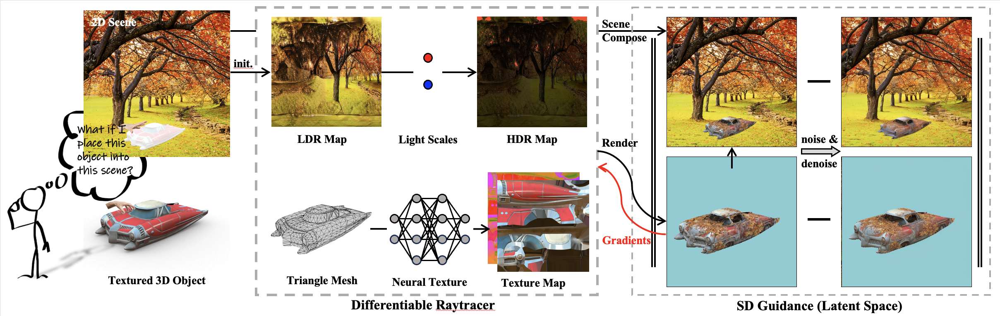

##  Place Your 3D Objects into 2D Scenes 

This Github repository hosts the future release of the code for paper **Scene-Conditional 3D Object Stylization and Composition**. Check the project page for videos and animations.

[[`arXiv`](https://arxiv.org/abs/2312.12419)] [[`project page`](https://shallowtoil.github.io/scene-cond-3d/)]

<div align="center">
  
</div>

### News :tada:
- December 2022 - Release the pre-print on [arXiv](https://arxiv.org/abs/2312.12419).


### Abstract

Recently, 3D generative models have made impressive progress, enabling the generation of almost arbitrary 3D assets from text or image inputs. However, these approaches generate objects in isolation without any consideration for the scene where they will eventually be placed. In this paper, we propose a framework that allows for the stylization of an existing 3D asset to fit into a given 2D scene, and additionally produce a photorealistic composition as if the asset was placed within the environment. This not only opens up a new level of control for object stylization, for example, the same assets can be stylized to reflect changes in the environment, such as summer to winter or fantasy versus futuristic settings-but also makes the object-scene composition more controllable. We achieve this by combining modeling and optimizing the object's texture and environmental lighting through differentiable ray tracing with image priors from pre-trained text-to-image diffusion models. We demonstrate that our method is applicable to a wide variety of indoor and outdoor scenes and arbitrary objects.

### Citation

```
@article{zhou2023sceneconditional,
    title={Scene-Conditional 3D Object Stylization and Composition},
    author={Jinghao Zhou and Tomas Jakab and Philip Torr and Christian Rupprecht},
    journal={arXiv preprint arXiv:2312.12419},
    year={2023}
}
```